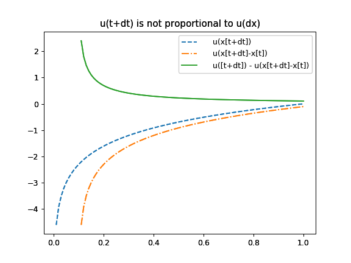

# prospect-theory
Mi review about Prospect Theory, from the perspective of the Ergodic Economics

In this post I follow the argument of Ole Peters about Prospect Theory and Expected Utility Theory ([tweet](https://twitter.com/ole_b_peters/status/1230545897790038016?ref_src=twsrc%5Etfw)).

He first reminds us that "*when economists define expected-utility theory, they say it optimizes $E[u(t+\delta t)]$ (expected terminal utility)*".
You will find this statement, for example, at [Barberis 2013](https://pubs.aeaweb.org/doi/pdfplus/10.1257/jep.27.1.173) (see second page).

This is true because $E[u(x[t+\delta t])]$ is a short-hand of the Expected Utility Statement, this is, that people optimize $E(\delta u)$, where

$$\delta u=u[x(t+\deltat)] - u[x(t)]$$

Of course $\delta u \neq u(t+\delta t)$, but they are proportional.
Our current wealth $x(t)$ and its utility $u[x(t)]$ are constant and are "independent" of any gamble on offer.
So, if we add it to $\delta u$, that leaves us with $u[x(t+\delta t)]$.

Adding a (deterministic) constant to $u$ makes no difference to decision theory because this no change the relative order between the expected change of two different utility functions

$$ E(\delta u) > E(\delta u\prime) $$.

This inequality doesn't change if we add the constant $u[x(t)]$ on both sides (or any other constant), and therefore the corresponding decision theory predicts the same preferences as before.

However, descriptions of prospect theory often wrongly say that EUT has no reference-level dependence.
The short-hand confuses some economist into thinking that $u[x(t)]$ and $x(t)$ are irrelevant, and that one can write $E(\delta u)$ as $E[u(\delta x)]$
But $u(\delta x)$ is not proportinal to $\delta u$, 

so the relative order between utility functions is broken. 

Formaly
$$ E[\delta u] = E[u(x[t+\delta t]) + u(x[t])] \propto E[u(x[t+\delta t])] =(Error)= E[u(\delta x)] = E[u(x[t+\delta t]-x[t])]$$

But
$E[u(x[t+\delta t])]$ is not proportinal to $E[u(x[t+\delta t]-x[t])]$, so neither is it proportional to $E[\delta u]$

